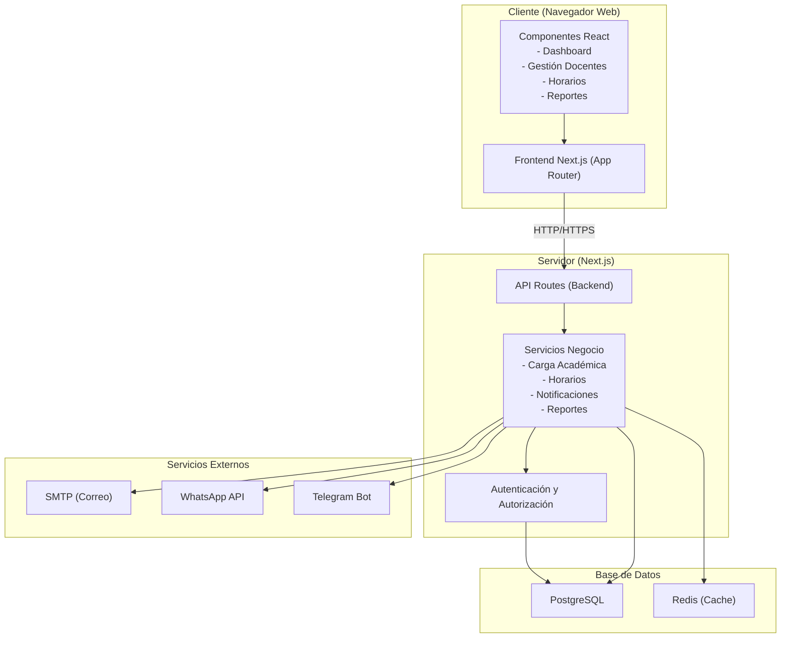

# Diagrama de Arquitectura

## Descripción de la Arquitectura

- **Cliente**: Aplicación web desarrollada con Next.js (App Router) y React.
- **Servidor**: Backend integrado en Next.js con API Routes.
- **Base de Datos**: PostgreSQL como base principal y Redis para caché.
- **Servicios Externos**: Integración con APIs de mensajería (correo, WhatsApp, Telegram).
