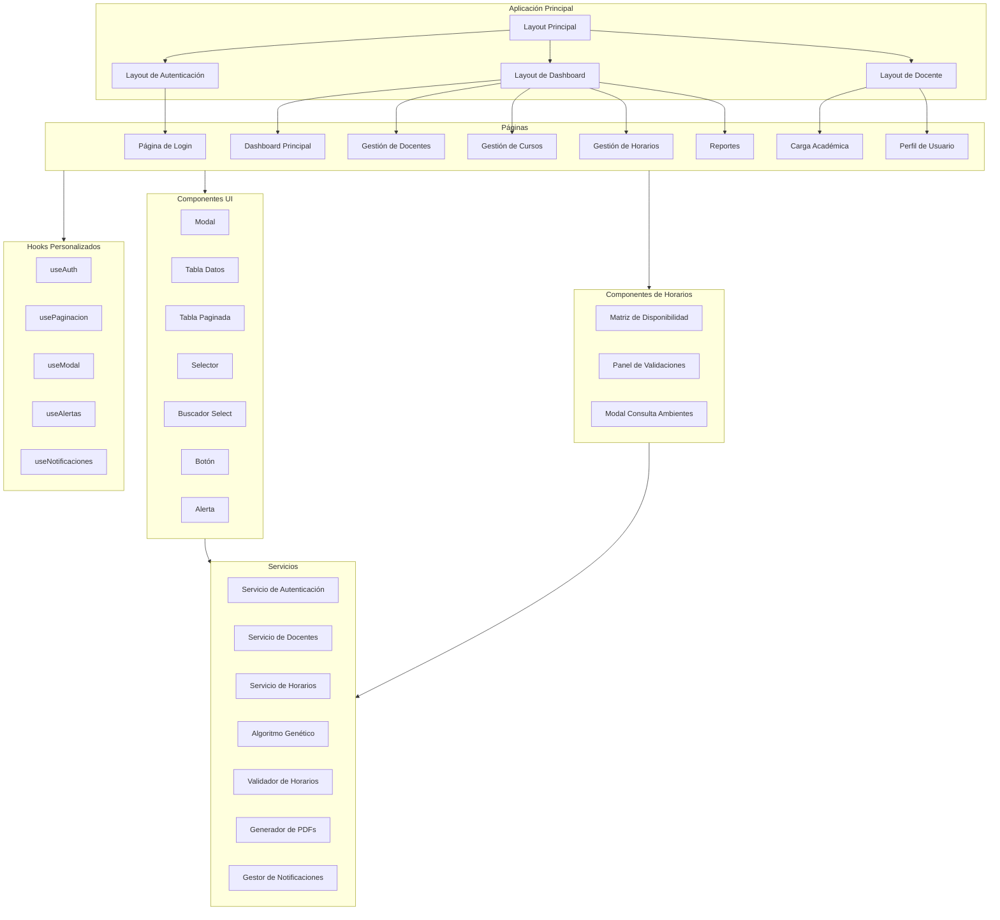

# Diagrama de Componentes

```mermaid
graph TB
    subgraph App["Aplicación Principal"]
        Layout["Layout Principal"]
        AuthLayout["Layout de Autenticación"]
        DashboardLayout["Layout de Dashboard"]
        DocenteLayout["Layout de Docente"]
    end

    subgraph Pages["Páginas"]
        Login["Página de Login"]
        DashboardPage["Dashboard Principal"]
        DocentesPage["Gestión de Docentes"]
        CursosPage["Gestión de Cursos"]
        HorariosPage["Gestión de Horarios"]
        ReportesPage["Reportes"]
        CargaAcademicaPage["Carga Académica"]
        PerfilPage["Perfil de Usuario"]
    end

    subgraph Components["Componentes UI"]
        Modal["Modal"]
        TablaDatos["Tabla Datos"]
        TablaPaginada["Tabla Paginada"]
        Selector["Selector"]
        SearchableSelect["Buscador Select"]
        Boton["Botón"]
        Alerta["Alerta"]
    end

    subgraph HorariosComponents["Componentes de Horarios"]
        MatrizDisponibilidad["Matriz de Disponibilidad"]
        PanelValidaciones["Panel de Validaciones"]
        ModalConsultaAmbientes["Modal Consulta Ambientes"]
    end

    subgraph Services["Servicios"]
        AuthService["Servicio de Autenticación"]
        DocenteService["Servicio de Docentes"]
        HorarioService["Servicio de Horarios"]
        AlgoritmoGenetico["Algoritmo Genético"]
        ValidadorHorario["Validador de Horarios"]
        GeneradorPDF["Generador de PDFs"]
        GestorNotificaciones["Gestor de Notificaciones"]
    end

    subgraph Hooks["Hooks Personalizados"]
        useAuth["useAuth"]
        usePaginacion["usePaginacion"]
        useModal["useModal"]
        useAlertas["useAlertas"]
        useNotificaciones["useNotificaciones"]
    end

    Layout --> DashboardLayout
    Layout --> DocenteLayout
    Layout --> AuthLayout
    AuthLayout --> Login
    DashboardLayout --> DashboardPage
    DashboardLayout --> DocentesPage
    DashboardLayout --> CursosPage
    DashboardLayout --> HorariosPage
    DashboardLayout --> ReportesPage
    DocenteLayout --> CargaAcademicaPage
    DocenteLayout --> PerfilPage
    Pages --> Components
    Pages --> HorariosComponents
    Pages --> Hooks
    Components --> Services
    HorariosComponents --> Services
```
