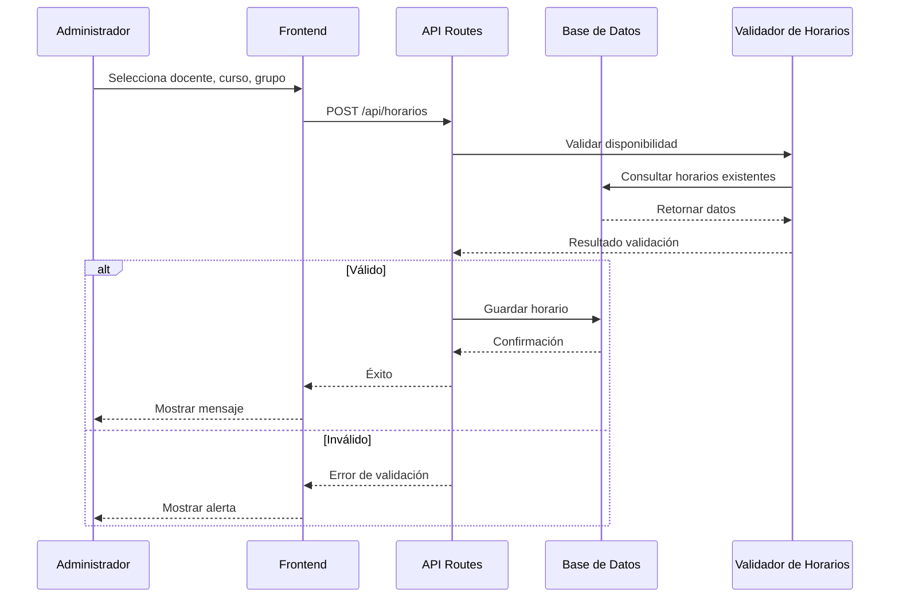
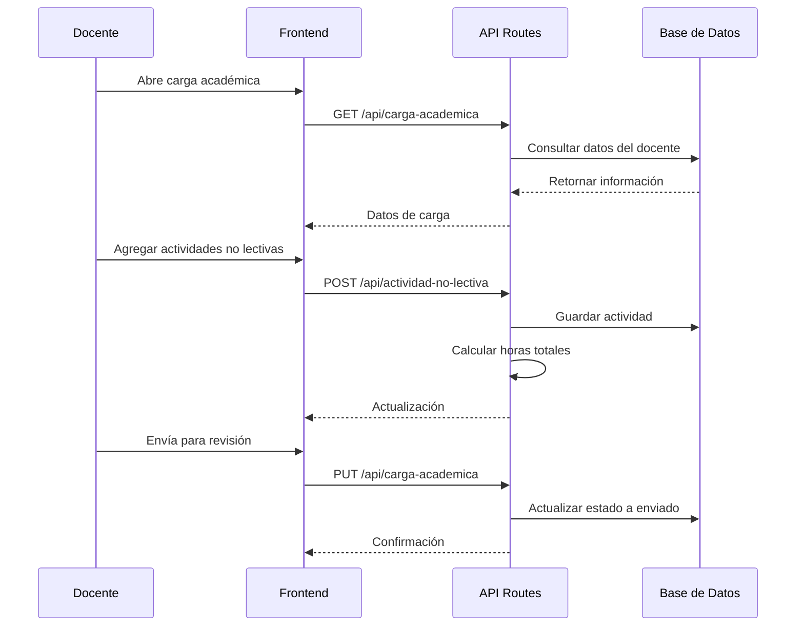

# Diagramas de Secuencia

## 1. Flujo de Asignación de Horario

```mermaid
sequenceDiagram
    participant Admin as Administrador
    participant Front as Frontend
    participant API as API Routes
    participant DB as Base de Datos
    participant Validador as Validador de Horarios

    Admin->>Front: Selecciona docente, curso, grupo
    Front->>API: POST /api/horarios
    API->>Validador: Validar disponibilidad
    Validador->>DB: Consultar horarios existentes
    DB-->>Validador: Retornar datos
    Validador-->>API: Resultado validación
    alt Válido
        API->>DB: Guardar horario
        DB-->>API: Confirmación
        API-->>Front: Éxito
        Front-->>Admin: Mostrar mensaje
    else Inválido
        API-->>Front: Error de validación
        Front-->>Admin: Mostrar alerta
    end
```

## 2. Flujo de Carga Académica

```mermaid
sequenceDiagram
    participant Docente as Docente
    participant Front as Frontend
    participant API as API Routes
    participant DB as Base de Datos

    Docente->>Front: Abre carga académica
    Front->>API: GET /api/carga-academica
    API->>DB: Consultar datos del docente
    DB-->>API: Retornar información
    API-->>Front: Datos de carga
    Docente->>Front: Agregar actividades no lectivas
    Front->>API: POST /api/actividad-no-lectiva
    API->>DB: Guardar actividad
    API->>API: Calcular horas totales
    API-->>Front: Actualización
    Docente->>Front: Envía para revisión
    Front->>API: PUT /api/carga-academica
    API->>DB: Actualizar estado a enviado
    API-->>Front: Confirmación
```
