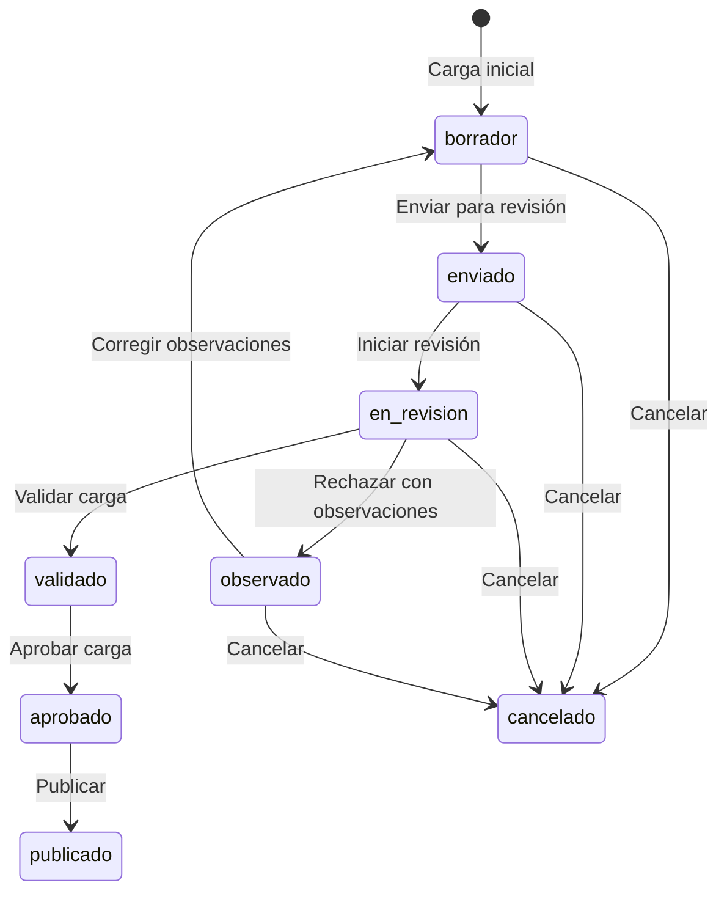
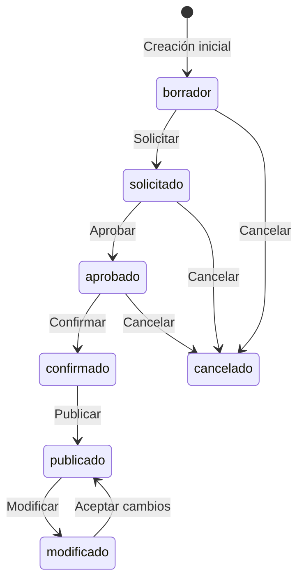
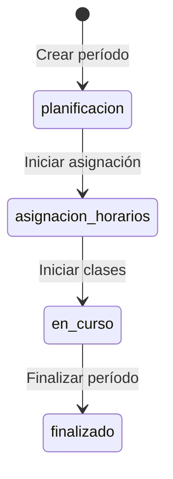

# Diagramas de Estados

## 1. Estados de la Carga Académica

```mermaid
stateDiagram-v2
    [*] --> borrador: Carga inicial
    borrador --> enviado: Enviar para revisión
    enviado --> en_revision: Iniciar revisión
    en_revision --> observado: Rechazar con observaciones
    en_revision --> validado: Validar carga
    observado --> borrador: Corregir observaciones
    validado --> aprobado: Aprobar carga
    aprobado --> publicado: Publicar
    borrador --> cancelado: Cancelar
    enviado --> cancelado: Cancelar
    en_revision --> cancelado: Cancelar
    observado --> cancelado: Cancelar
```

## 2. Estados de un Horario Asignado

```mermaid
stateDiagram-v2
    [*] --> borrador: Creación inicial
    borrador --> solicitado: Solicitar
    solicitado --> aprobado: Aprobar
    aprobado --> confirmado: Confirmar
    confirmado --> publicado: Publicar
    publicado --> modificado: Modificar
    modificado --> publicado: Aceptar cambios
    borrador --> cancelado: Cancelar
    solicitado --> cancelado: Cancelar
    aprobado --> cancelado: Cancelar
```

## 3. Estados de un Período Académico

```mermaid
stateDiagram-v2
    [*] --> planificacion: Crear período
    planificacion --> asignacion_horarios: Iniciar asignación
    asignacion_horarios --> en_curso: Iniciar clases
    en_curso --> finalizado: Finalizar período
```
